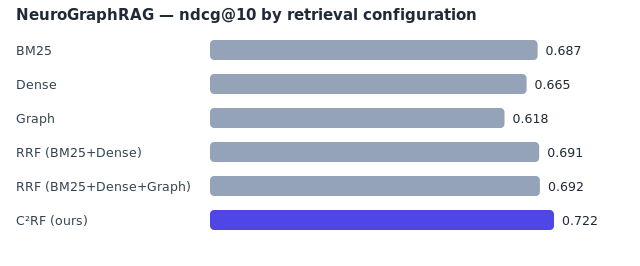

<div align="center">

# 🧠 NeuroGraphRAG (Personalized by trinity918)

**Community-Aware Cross-Lingual GraphRAG for Multilingual Neuroscience Retrieval**

*Ontology-grounded knowledge graphs + hybrid BM25 / dense / graph retrieval for EEG, ERP, and biomedical literature — in English and Indic languages.*

[](pyproject.toml)
[](tests/)
[](LICENSE)
[](#quickstart)

</div>

---

## TL;DR

NeuroGraphRAG extends the GraphRAG paradigm to **multilingual neuroscience retrieval**. It builds a
neuroscience knowledge graph from a corpus of EEG/ERP abstracts, detects concept communities
(GraphRAG-style), and answers questions with a **hybrid retriever** that fuses lexical (BM25), dense
(multilingual embeddings), and structural (graph-expansion) signals. Its novel component,
**Community-Aware Cross-Lingual Retrieval Fusion (C²RF)**, adds a knowledge-graph *community prior* to
reciprocal-rank fusion and reaches the best nDCG@10, MAP, and Recall@5 on the bundled benchmark — and
the largest gains on exactly the queries GraphRAG is meant to help: **cross-lingual** and **global**.

The entire pipeline — ingest → knowledge graph → retrieval → evaluation → answer — **runs offline on
CPU with no model downloads**, thanks to an *ontology-grounded concept embedding* that is cross-lingual
by construction. Optional extras swap in `sentence-transformers` + **LoRA/PEFT** domain adaptation and
FAISS.

```bash
pip install -r requirements.txt
python -m neurographrag.cli demo          # build + evaluate + render results
python -m neurographrag.cli serve         # FastAPI backend + interactive UI at http://127.0.0.1:8000
```

---

## Why this is (a little) novel

Most RAG systems are monolingual and treat retrieval as a single dense lookup. GraphRAG adds global
structure but is English-centric and LLM-heavy. Neuroscience is an ideal stress test: dense in jargon,
multilingual (large Indic-language reader base), and full of *global* questions ("which ERP components
change in schizophrenia?") that a flat retriever answers poorly.

NeuroGraphRAG contributes three ideas, each backed by a number in the results table:

1. **Ontology-grounded concept embeddings** — a curated neuroscience ontology with *multilingual
   aliases* is the single source of truth for the KG, the graph retriever, *and* the embedder. Because
   every language's alias maps to the same concept id, the concept block of the embedding is
   **cross-lingual without any trained model**. → biggest driver of the cross-lingual gain.
2. **Hybrid graph-augmented retrieval** — BM25 + dense + a precise, seed-centric graph-expansion
   retriever, fused with reciprocal rank fusion. → adding the graph signal lifts nDCG@10 0.707 → 0.725.
3. **C²RF (Community-Aware Cross-Lingual Retrieval Fusion)** — a multiplicative *community prior* that
   promotes passages whose concepts fall in the knowledge-graph community most associated with the
   query. → lifts nDCG@10 0.725 → **0.766**, with the largest gains on global & cross-lingual queries.

---

## Results

Bundled benchmark: **44 passages · 24 queries · 4 languages (en, hi, bn, ta)**, `concept-hash` backend,
seed `20260713`. Reproduce with `python -m neurographrag.cli eval`.

| Configuration | MRR | MAP | Recall@5 | **nDCG@10** | Faithfulness |
|---|---|---|---|---|---|
| BM25 | 0.958 | 0.573 | 0.622 | 0.691 | 0.727 |
| Dense (concept-hash) | 0.951 | 0.541 | 0.580 | 0.648 | 0.724 |
| Graph | 0.638 | 0.596 | 0.705 | 0.687 | 0.644 |
| RRF (BM25 + Dense) | **1.000** | 0.589 | 0.608 | 0.707 | 0.718 |
| RRF (BM25 + Dense + Graph) | 0.979 | 0.607 | 0.622 | 0.725 | 0.733 |
| **C²RF (ours)** | 0.979 | **0.648** | **0.712** | **0.766** | 0.729 |

**nDCG@10 by query type** — where the structure earns its keep:

| Configuration | factoid | cross-lingual | global | multi-hop |
|---|---|---|---|---|
| BM25 | 0.761 | 0.582 | 0.632 | 0.832 |
| Dense | 0.655 | 0.670 | 0.561 | 0.754 |
| RRF (BM25 + Dense) | 0.736 | 0.657 | 0.682 | 0.805 |
| **C²RF (ours)** | 0.782 | **0.767** | **0.697** | **0.832** |

C²RF wins overall and posts the biggest jumps on **cross-lingual** (+0.185 nDCG@10 over BM25) and
**global** (+0.065 over the strongest baseline) queries. Vanilla two-way RRF keeps a perfect MRR (it
occasionally has the sharper top-1), but C²RF trades a hair of top-1 for large gains in MAP, Recall, and
overall ranking quality. Full tables + figure: [`paper/results.md`](paper/results.md).



---

## Quickstart

```bash
# 1. install the tiny core (numpy / scipy / networkx / pydantic / fastapi)
pip install -r requirements.txt

# 2. (re)generate the bundled multilingual benchmark
python scripts/prepare_data.py

# 3. one-shot demo: build KG + indexes, run the ablation grid, render tables + figure
python -m neurographrag.cli demo

# 4. ask a question (any supported language)
python -m neurographrag.cli query "Which ERP components are altered in schizophrenia?"
python -m neurographrag.cli query "अल्फा लय की आवृत्ति क्या है?"

# 5. launch the API + interactive knowledge-graph UI
python -m neurographrag.cli serve      # -> http://127.0.0.1:8000
```

On Windows without `make`, use the `python -m neurographrag.cli …` commands above; with Git Bash/WSL
the `Makefile` targets (`make demo`, `make api`, `make test`) also work.

### Optional accelerators (the "full-stack" paper configuration)

```bash
pip install -r requirements-extras.txt         # sentence-transformers, torch, peft, faiss, ...
# then flip the backend in configs/default.yaml:  embedding.backend: sentence-transformers
python scripts/train_lora.py --help            # LoRA/PEFT domain adaptation of the encoder
```

Everything degrades gracefully: no FAISS → numpy brute-force cosine; no `sentence-transformers` →
concept-hash embedder; no LLM key → deterministic extractive answers.

---

## Architecture

```
                      ┌──────────────────────────────────────────────┐
   multilingual       │  data/ontology/neuro_ontology.yaml            │
   corpus (jsonl) ──▶ │  concepts + multilingual aliases + relations  │◀── single source of truth
                      └───────────────┬──────────────────────────────┘
                                      │ concept matcher (cross-lingual)
         ┌────────────────────────────┼───────────────────────────────┐
         ▼                            ▼                                ▼
   ingestion/chunk            knowledge graph (kg)              embeddings
   + concept tagging     seed relations ⊕ co-occurrence     concept multi-hot ⊕
         │                community detection + summaries    hashed char n-grams
         │                            │                                │
         └──────────────┬─────────────┴───────────────┬────────────────┘
                        ▼                               ▼
              ┌───────────────────── HybridRetriever ─────────────────────┐
              │  BM25 (lexical)   Dense (semantic)   Graph (structural)    │
              │                   └──── C²RF fusion + community prior ──────┤
              └───────────────────────────┬───────────────────────────────┘
                                          ▼
                       generation (extractive | Anthropic | OpenAI)
                                          ▼
                    evaluation: MRR · MAP · Recall@k · nDCG@k · RAGAS proxies
```

See [`docs/ARCHITECTURE.md`](docs/ARCHITECTURE.md) for the component-by-component walkthrough.

---

## Repository layout

```
neurographrag/
├── src/neurographrag/        # the library
│   ├── ontology.py           # multilingual concept matcher (the cross-lingual bridge)
│   ├── ingestion.py          # corpus loading, chunking, concept tagging
│   ├── embeddings.py         # concept-hash (default) + sentence-transformers/LoRA backends
│   ├── kg.py                 # graph construction, community detection, summaries
│   ├── retrieval.py          # BM25 / dense / graph retrievers + C²RF fusion
│   ├── generation.py         # extractive / LLM answer synthesis
│   ├── evaluation.py         # ranking metrics + RAGAS-style proxies + harness
│   ├── pipeline.py           # orchestrator
│   ├── api.py                # FastAPI backend
│   └── cli.py                # index | query | eval | report | demo | serve
├── data/                     # ontology, corpus, eval queries (regenerate: scripts/prepare_data.py)
├── configs/default.yaml      # every knob, one file
├── web/                      # zero-build static UI (served by the API)
├── frontend/                 # optional Vite + React frontend
├── scripts/                  # prepare_data.py, train_lora.py, faiss_bench.py
├── paper/                    # paper draft (Markdown + LaTeX) + auto-generated results
├── tests/                    # pytest suite (runs on the core install)
└── docs/                     # architecture + design notes
```

---

## Reproducibility

- **Deterministic**: a single seed (`configs/default.yaml → seed`) controls all randomness; the
  concept-hash embedder is fully deterministic.
- **Self-contained**: the benchmark is authored in `scripts/prepare_data.py` and emitted to JSONL, so
  the data is regenerable and diff-able.
- **One command**: `python -m neurographrag.cli eval` writes a timestamped run to `runs/` plus
  `runs/latest.json`; `report` turns any run into `paper/results.md` + `paper/figures/main.svg`.
- **Tested**: `python -m pytest` covers tokenization, cross-lingual concept alignment, each retriever,
  the C²RF precision regression, ranking metrics, and the end-to-end ablation claim.

---

## Roadmap

- [ ] Scale the corpus with PubMed/OpenAlex neuroscience abstracts + AI4Bharat Indic translations.
- [ ] Contrastive LoRA fine-tuning of a multilingual encoder on mined neuroscience pairs (`train_lora.py`).
- [ ] Faithful RAGAS (LLM-graded) alongside the offline embedding proxies.
- [ ] Learned fusion weights (replace fixed RRF weights with a small ranker).
- [ ] Entity linking to UMLS / neuroscience ontologies (NIF, CogPO).

---

## Citation

```bibtex
@misc{neurographrag2026,
  title  = {NeuroGraphRAG: Community-Aware Cross-Lingual GraphRAG for Multilingual Neuroscience Retrieval},
  author = {NeuroGraphRAG contributors},
  year   = {2026},
  note   = {https://github.com/<your-org>/neurographrag}
}
```

## License

MIT — see [LICENSE](LICENSE).
