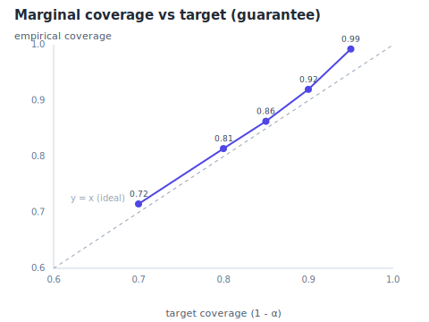
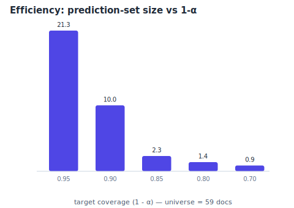
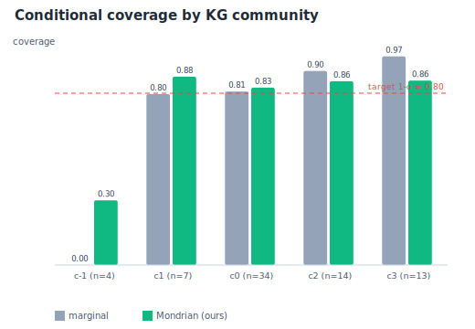
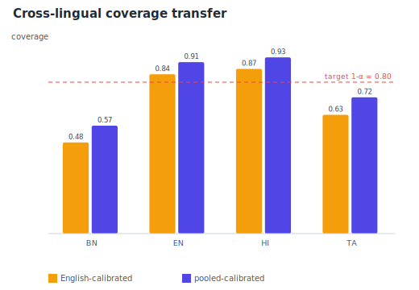
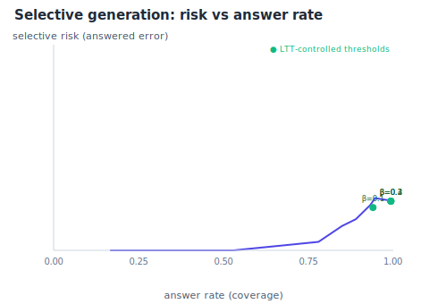

# Conformal GraphRAG — Risk-Controlled Retrieval Results

- 72 queries · 59 docs · languages bn, en, hi, ta
- System under test: `c2rf` fusion of bm25, dense, graph
- 500 random calibration/test resamples · seed 20260713 · α* = 0.2

## 1. Marginal coverage guarantee

| target 1−α | empirical coverage | avg set size |
|---|---|---|
| 0.95 | 0.992 ± 0.032 | 21.3 / 59 |
| 0.90 | 0.920 ± 0.070 | 10.0 / 59 |
| 0.85 | 0.863 ± 0.080 | 2.3 / 59 |
| 0.80 | 0.814 ± 0.086 | 1.4 / 59 |
| 0.70 | 0.715 ± 0.104 | 0.9 / 59 |

 

## 2. Conditional coverage — marginal conformal hides per-group failures

At target 0.80, the **worst knowledge-graph community** gets only **0.038** coverage under marginal calibration; community-conditional (Mondrian) calibration raises the worst group to **0.228**.

## 3. Cross-lingual coverage transfer

Calibrating on English and testing per language reveals that the guarantee does **not** transfer uniformly; pooled (multilingual) calibration narrows the gap.

| language | English-calibrated | pooled-calibrated |
|---|---|---|
| bn | 0.482 | 0.570 |
| en | 0.842 | 0.906 |
| hi | 0.870 | 0.931 |
| ta | 0.628 | 0.720 |

## 4. Risk-controlled selective generation

Base top-1 error is 0.097. Learn-then-Test picks a confidence threshold so the answered-query error stays under a target β:

| target risk β | achieved test risk | answer rate |
|---|---|---|
| 0.10 | 0.083 | 0.940 |
| 0.20 | 0.096 | 0.993 |
| 0.30 | 0.096 | 0.993 |
| 0.40 | 0.096 | 0.993 |

